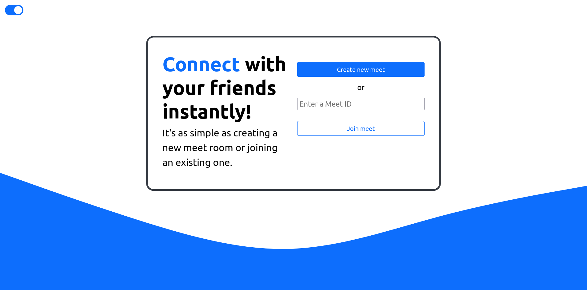
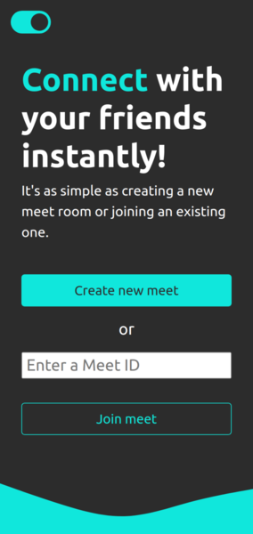
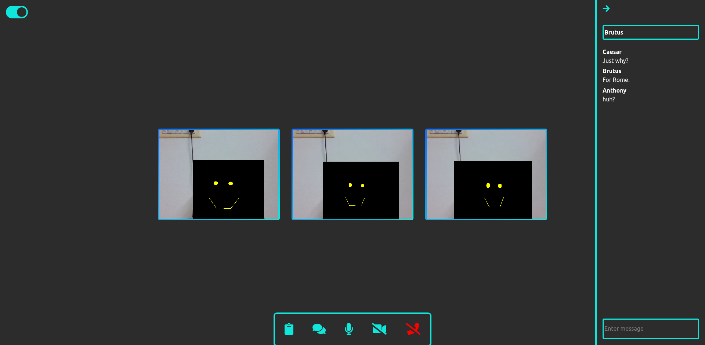

# Video Chat Web-app
A video-communication website made using ReactJS and NodeJS where users
can connect with other users in real time. Supports textual messages during
meet and also both light and dark themes.

You can visit the site [here](https://react-vid-chat.herokuapp.com/).  

## Preview
  

   

  

## Troubleshoot
1. In case you don't see any other user appear in meet room, simply refresh
    the page. The website relies heavily on good and stable connection.
